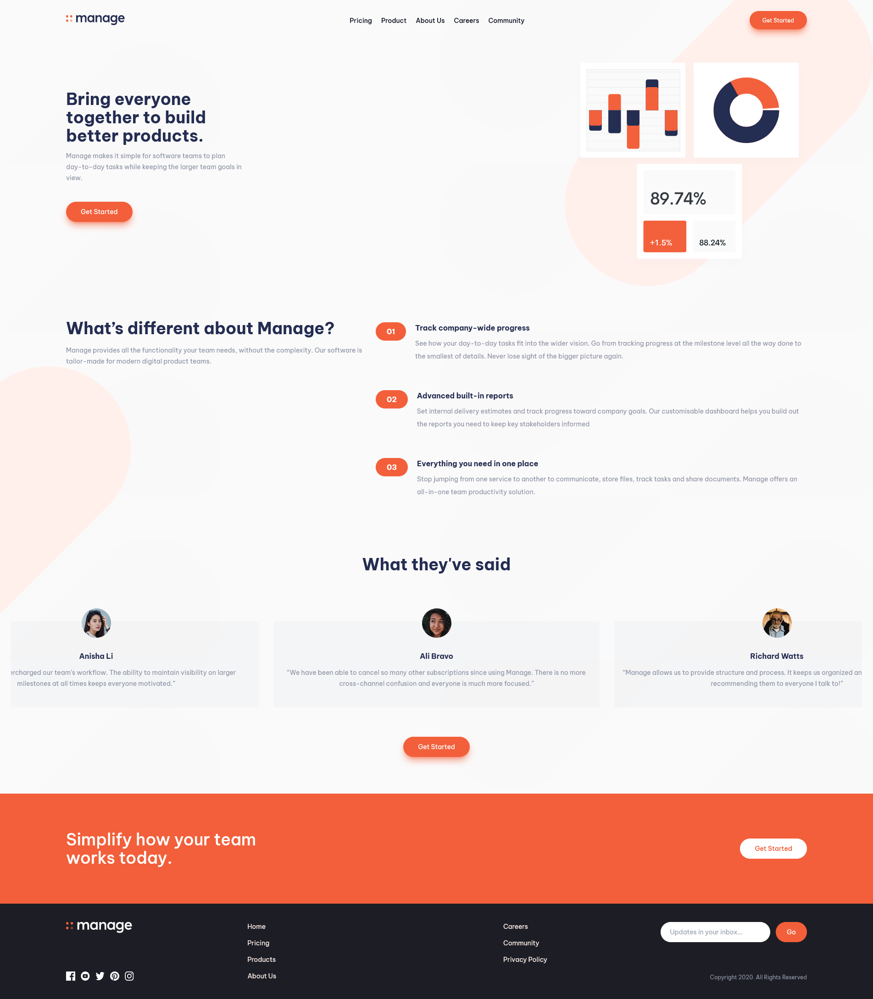

# Manage landing page || Frontend Mentor

This is a solution to the [Manage landing page challenge on Frontend Mentor](https://www.frontendmentor.io/challenges/manage-landing-page-SLXqC6P5). Frontend Mentor challenges help you improve your coding skills by building realistic projects.

## Table of contents

- [Overview](#overview)
  - [The challenge](#the-challenge)
  - [Screenshot](#screenshot)
  - [Links](#links)
- [My process](#my-process)
  - [Built with](#built-with)
  - [Useful resources](#useful-resources)
- [Author](#author)

## Overview

### The challenge

Users should be able to:

- View the optimal layout for the site depending on their device's screen size
- See hover states for all interactive elements on the page
- See all testimonials in a horizontal slider
- Receive an error message when the newsletter sign up `form` is submitted if:
  - The `input` field is empty
  - The email address is not formatted correctly

### Screenshot

### Links

- Solution URL: [Here]()
- Live Site URL: [Here](https://manage-landing-page-plum.vercel.app/)

## My process

### Built with

- [React](https://reactjs.org/) - JS library
- [Tailwind CSS](https://tailwindcss.com/) - CSS framework
- [Headless UI](https://headlessui.dev/) - UI library
- [SwiperJs](https://swiperjs.com/) - Slider library

### Useful resources

- [SwiperJs React Docs](https://swiperjs.com/react) - This helped set up the slider and modify the styles to fit the project for different breakpoints.

- [Headless UI Menu Docs](https://headlessui.dev/react/menu) - Headless UI is very easy to setup that's why I use it to create the navigation menu.

## Author

- Website - [Mohanad Portfolio](https://mohanad-portfolio.pages.dev/)
- Frontend Mentor - [@MohanadOO](https://www.frontendmentor.io/profile/MohanadOO)
- Twitter - [@Mohanad_OOO](https://twitter.com/Mohanad_OOO)
